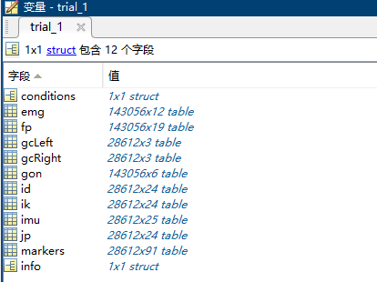
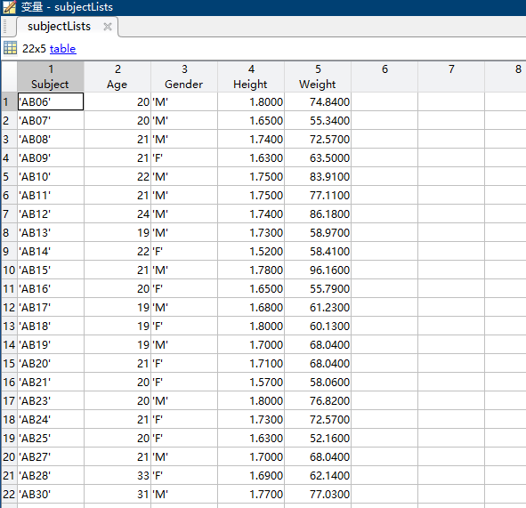

# Gait-Library-HARLab

# 使用说明
### 环境搭建
下载数据集，下载Opensim，注意Opensim使用默认路径，不要自定义安装

解压fcgm3chfff-1，解压scripts，解压AB06等数据集，文件路径如下
```angular2html
fcgm3chfff-1
-AB06
    --10_09_18
        ---levelground
        ---ramp
        ---stair
        ---treadmill
-AB07
    --10_14_18
        ---levelground
        ---ramp
        ---stair
        ---treadmill
......

-scripts
    --EpicToolbox
    --lib
    --MoCapTools
    --*.m
    
SubjectInfo.mat
```
运行EpicToobox文件夹下的`install.m`文件
```angular2html
Installing EPICTOOLBOX...
Scripts added to path...
Path saved
```
运行MoCapTools文件架下的`install.m`文件
```angular2html
Scripts added to path...
Path saved...
If you are new to using this repo, please see +Osim/examples/example.m for information on how to use OpenSim
via MATLAB, or +Vicon/examples/example.m for information on automated iterative gap-filling via MATLAB.
Please restart MATLAB.
```


## Matlab脚本基本使用方法
**将仓库中`My_Scripts`的文件放在`fcgm3chfff-1/scripts`中运行**

#### 利用EpicToolBox进行基本数据读取

```matlab
init();def=defaults;
SUBJECT = 'AB06';%选择受试者
AMBULATION = 'treadmill';%选择地形
TRIAL = {'treadmill_02_01.mat','treadmill_01_01.mat'};%选择实验对应文件名称
SENSORS = {'markers','gcLeft','gcRight','conditions','ik','id','emg','imu','gon','jp'};%选择需要的种类
%获取所有同名实验不同类型数据的路径
allfiles = f.fileList("Subject",SUBJECT,"Mode",AMBULATION,"Trial",TRIAL,"Sensor",SENSORS);
%每个实验对应的数据被封装在一个trial结构体内部
trials = f.EpicToolbox(allfiles);
%选择第一次实验，treadmill_02_01的数据
trial_1 = trails{1};
```



可以通过`trial_1`读取对应类型的数据

#### 通过SubjectInfo.mat获取患者信息

在`fcgm**`文件夹解压后有`SubjectInfo.mat`文件，内部包含用户身高体重等数据

```matlab
init();def = defaults;
subjectLists = load(def.SUBJECT_INFO_FILE);
```




#### 通过gcLeft/gcRight划分步态

`gcTopic`定义了`HeelStrike`和`Toeoff`

```matlab
% 通过右脚HeelStrike划分步态
allstrides = [];
for i =1:numel(trials)
    trial = trials{i};
    strides = segment_gc(trial,'GCtopic','gcRight','GCchannel','HeelStrike');
    fprintf("\t %d gaits in treadmill_0%d \n",size(strides,1),i);
    allstrides = [allstrides;strides];
end
fprintf('\t Totally %d gaits\n',size(allstrides,1));
% Header归一化
%% 归一化步态对应的时间为0-1，对应0-100%
allstrides = Topics.normalize(allstrides,Topics.topics(allstrides),'Header');
%% interpolate将根据Header的0-1对数据进行插值
allstrides = Topics.interpolate(allstrides,0:0.01:1);
%% 对于ID和JP的数据往往需要根据用户体重进行归一化
allstrides = Topics.transform(@(x)(x/subjectWeight),allstrides,{'id','jp'});

```


#### 获得均匀速度的数据

跑步机速度变换稳定时的数据标记为`treadmill`

```matlab
alllabels = cell(size(allstrides));
for i=1:numel(allstrides)
    stride = allstrides{i};
    stride_condition = stride.conditions;
    if strcmp(ambulationModes,'treadmill')
        if numel(unique(stride_condition.speed.Speed))>2
            alllabels{i}='discard';%速度不稳定，无法分类
        else
            alllabels{i}='treadmill';%速度
        end
        continue;
    end
end
```


## 关于数据集

数据集包含四种地形，每种地形下采集如下信息，且对应同一组实验的不同种数据名相同，存储在不同文件夹中。


### conditions
Experiment description, locomotion mode labels,terrain condition (walking speed, ramp incline, or stair height).Sampled at 1000Hz.
### emg
Electromyography from 11 muscles. Sampled at 1000Hz, bandpass filtered (20-400Hz).
### fp
Ground reaction force data of all force plates used in a trial.Sampled at 1000Hz.
### gcLeft/gcRight 
Gait cycle segmented by heel strike or toe off of left/right foot. Sampled at 200Hz
### id
Inverse dynamics calculated by OpenSim using ground reaction force
            and motion capture kinematic data. Sampled at 200Hz.
### ik
Inverse kinematics calculated by OpenSim using motion capture data.
            Sampled at 200Hz.
### imu
Inertial Measurement Unit data from trunk, thigh, shank, and 
            foot segments. Sampled at 200Hz.
### jp
Estimation of instantaneous joint power using joint moment and
            angular velocity. Sampled at 200Hz.
### markers
Marker trajectories from motion capture. Sampled at 200Hz.